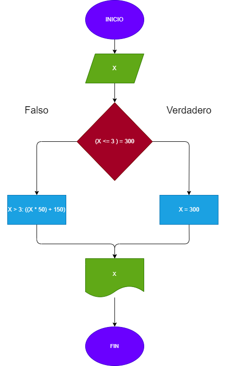

# Ejercicio No. 1

Crear un programa que calcule el valor de los minutos según las reglas establecidas:
 a. Toda llamada que dure tres minutos o menos tienen un costo de $300.
 b. Cada minuto adicional cuesta $50.

# Diagrama

